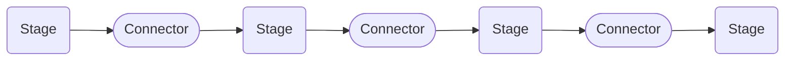
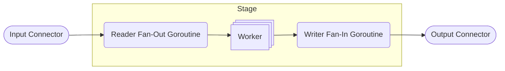

# acmetel

Data processing pipeline library for Go intended to be used for implementing _near_ real-time telemetry systems. The main focus of the project is to decode CAN messages/signals for the Squadra Corse PoliTO formula SAE race car.

## Pipeline

A pipeline consists of a sequence of stages. Each stage forwards data to the next through a connector.



The lifecycle of a pipeline is divided in the following phases:

-   Initialization `Init(ctx context.Context) error`: it must be called before running the pipeline and it initializes all the stages

-   Running `Run(ctx context.Context)`: it runs all the stages in different goroutines

-   Stopping `Stop()`: it waits for all the stages to finish

Here is an example:

```go
func main() {
    // This lines are used to handle graceful shutdown
    // by linking the main context to the interrupt signal.
    // This context will be passed to the pipeline.
	ctx, cancelCtx := signal.NotifyContext(context.Background(), os.Interrupt, syscall.SIGINT, syscall.SIGTERM)
	defer cancelCtx()

    /*
    *   Here you should define the stages and connectors.
    *   In this case stage1, stage2, stage3
    */

    // Create the pipeline
	pipeline := acmetel.NewPipeline()

    // Add the stages
	pipeline.AddStage(stage1)
	pipeline.AddStage(stage2)
	pipeline.AddStage(stage3)

    // Initialize the pipeline
	if err := pipeline.Init(ctx); err != nil {
		panic(err)
	}

    // Run the pipeline in a different goroutine
	go pipeline.Run(ctx)
    // Stop the pipeline after the main context is done
	defer pipeline.Stop()

    // Wait for the main context to be done
	<-ctx.Done()
}
```

## Stage

A stage is the basic processing unit of the pipeline. It is a struct that implements the `Stage` interface. It may use a connector to forward data to the next stage and it may use a another one to receive data from the previous stage. Within a stage, a worker pool is used to process data in multiple goroutines.



The `Stage` interface defines the following methods:

-   `Init(ctx context.Context) error`

-   `Run(ctx context.Context)`

-   `Stop()`

These methods are called during the corresponding phase by the pipeline.
Currently, there are 4 kinds of stages:

### Ingress Stage

The Ingress stage is used to receive data from outside of the pipeline. This kind of stage only has an **Output Connector** because it reads data from another source before processing and forwarding it to the next stage through the connector.

#### UDP

The `ingress.UDP` is a stage that receives data from a UDP socket, and writes an `message.UDPPayload` to the output connector. Example:

```go
func main() {
    /*
    *   Here you should setup the main context as shown in the pipeline example.
    */

    // Create a new connector between ingress and stage2
    ingressToStage2 := connector.NewRingBuffer[*message.UDPPayload](4096)

    // Create the UDP ingress
    udpCfg := ingress.NewDefaultUDPConfig()
    udpIngress := ingress.NewUDP(udpCfg)
    // Set the output connector
	udpIngress.SetOutput(ingressToStage2)

    /*
    *   Here you should define the next stages and connectors.
    *   In this case stage2
    */

    // Create the pipeline
    pipeline := acmetel.NewPipeline()

    // Add the stages
    pipeline.AddStage(udpIngress)
    pipeline.AddStage(stage2)

    /*
    *   Here you should run the pipeline as shown in the pipeline example.
    */
}
```

### Handler Stage

An handler stage is used to convert/process an input message into an output message. For this reason, an handler stage has an **Input Connector** and an **Output Connector**.

#### Cannelloni

The `handler.Cannelloni` is a stage that receives an `message.UDPPayload` and converts its bytes payload from [the cannelloni UDP format](https://github.com/mguentner/cannelloni/blob/master/doc/udp_format.md) into an `message.RawCANMessageBatch`. Example:

```go
func main() {
    /*
    *   Here you should setup the main context as shown in the pipeline example.
    */

    // Create a new connector between previous stage and the cannelloni handler
    prevToCannelloni := connector.NewRingBuffer[*message.UDPPayload](4096)
    // Create a new connector between the cannelloni handler and the next stage
    cannelloniToNext := connector.NewRingBuffer[*message.RawCANMessageBatch](4096)

    /*
    *   Here you should setup your previous stages.
    */

    // Create the cannelloni handler
    cannelloniCfg := handler.NewDefaultCannelloniConfig()
	cannelloniHandler := handler.NewCannelloni(cannelloniCfg)
    // Set the input connector
    cannelloniHandler.SetInput(prevToCannelloni)
    // Set the output connector
    cannelloniHandler.SetOutput(cannelloniToNext)

    /*
    *   Here you should define the next stages and connectors.
    */

    // Create the pipeline
    pipeline := acmetel.NewPipeline()

    // Add the stages
    pipeline.AddStage(prevStage)
    pipeline.AddStage(cannelloniHandler)
    pipeline.AddStage(nextStage)

    /*
    *   Here you should run the pipeline as shown in the pipeline example.
    */
}
```

#### CAN

The `handler.CAN` is a stage that receives an `message.RawCANMessageBatch` and decodes the signals contained in the messages into an `message.CANSignalBatch`. For the decoding, it uses the [acmelib](https://github.com/squadracorsepolito/acmelib) library. Example:

```go
func main() {
    /*
    *   Here you should setup the main context as shown in the pipeline example.
    */

    // Create a new connector between the previous stage and the CAN handler
    prevToCAN := connector.NewRingBuffer[*message.RawCANMessageBatch](4096)
    // Create a new connector between the CAN handler and the next stage
    canToNext := connector.NewRingBuffer[*message.CANSignalBatch](4096)

    /*
    *   Here you should setup your previous stages.
    */

    // Create the CAN handler
    canCfg := handler.NewDefaultCANConfig()
    // You need to provide a slice of []*amelib.Message
	canCfg.Messages = getMessages()
	canHandler := handler.NewCAN(canCfg)
	canHandler.SetInput(prevToCAN)
	canHandler.SetOutput(canToNext)

    /*
    *   Here you should define the next stages and connectors.
    */

    // Create the pipeline
    pipeline := acmetel.NewPipeline()

    // Add the stages
    pipeline.AddStage(prevStage)
    pipeline.AddStage(canHandler)
    pipeline.AddStage(nextStage)

    /*
    *   Here you should run the pipeline as shown in the pipeline example.
    */
}

func getMessages() []*acmelib.Message {
	messages := []*acmelib.Message{}

	dbcFile, err := os.Open("filename.dbc")
	if err != nil {
		panic(err)
	}
	defer dbcFile.Close()
	bus, err := acmelib.ImportDBCFile("bus_name", dbcFile)
	if err != nil {
		panic(err)
	}

	for _, nodeInt := range bus.NodeInterfaces() {
		for _, msg := range nodeInt.SentMessages() {
			messages = append(messages, msg)
		}
	}

	return messages
}
```

### Egress Stage

The egress stage is used to deliver messages to the outside. This kind of stage only has an **Input Connector** because it writes data to another source.

#### QuestDB

The `egress.QuestDB` is a stage that sends data to a QuestDB database. It receives an `message.CANSignalBatch` and inserts it into a QuestDB database. Example:

```go
func main() {
    /*
    *   Here you should setup the main context as shown in the pipeline example.
    */

    // Create a new connector between the previous stage and the QuestDB egress
    prevToQuestDB := connector.NewRingBuffer[*message.RawCANMessageBatch](4096)

    /*
    *   Here you should setup your previous stages.
    */

    questDBCfg := egress.NewDefaultQuestDBConfig()
	questDBEgress := egress.NewQuestDB(questDBCfg)
	questDBEgress.SetInput(prevToQuestDB)

    // Create the pipeline
    pipeline := acmetel.NewPipeline()

    // Add the stages
    pipeline.AddStage(prevStage)
    pipeline.AddStage(questDBEgress)

    /*
    *   Here you should run the pipeline as shown in the pipeline example.
    */
}
```

## Connector

A connector is a component that forwards data between stages. It must implement the `Connector` interface. It will block until new data is available.

The `Connector` interface defines the following generic methods:

-   `Write(item T) error`: writes an item to the connector. It will block until the connector is full

-   `Read() (T, error)`: reads an item from the connector. It will block until an item is available

-   `Close()`: closes the connector. It is called by the `Stop()` method of the stage that **writes** to the connector, i.e. the **Output Connector**. When a connector is closed, it not possible to write to it anymore, but you can still read the remaining items from it.

### Ring Buffer

The `connector.RingBuffer` is a _lock-free_ multiple producer multiple consumer ring buffer that can be used as a connector. Example:

```go
func main() {
    /*
    *   Here you should setup the main context as shown in the pipeline example.
    */

    // Create a new ring buffer connector with 4096 slots
    ingressToAdapter := connector.NewRingBuffer[*ingress.UDPData](4096)

    /*
    *   Here you should setup the stages and the pipeline as shown in the other examples.
    */
}
```

### Channel

The `connector.Channel` is a connector implemented using a golang channel. Example:

```go
func main() {
    /*
    *   Here you should setup the main context as shown in the pipeline example.
    */

    // Create a new channel connector with a buffer of 1024
    ingressToAdapter := connector.Channel[*ingress.UDPData](1024)

    /*
    *   Here you should setup the stages and the pipeline as shown in the other examples.
    */
}
```

## Examples

For a real example server that implements a CAN processing pipeline, check out the `test/server` folder.
