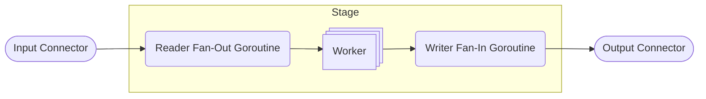

# acmetel

Data processing pipeline library for Go intended to be used for implementing _near_ real-time telemetry systems. The main focus of the project is to decode CAN messages/signals for the Squadra Corse PoliTO formula SAE race car.

## Pipeline

A pipeline consists of a sequence of stages. Each stage forwards data to the next through a connector.


The lifecycle of a pipeline is divided in the following phases:

-   Initialization `Init(ctx context.Context) error`: it must be called before running the pipeline and it initializes all the stages

-   Running `Run(ctx context.Context)`: it runs all the stages in different goroutines

-   Stopping `Stop()`: it waits for all the stages to finish

Here is an example:

```go
func main() {
    // This lines are used to handle graceful shutdown
    // by linking the main context to the interrupt signal.
    // This context will be passed to the pipeline.
	ctx, cancelCtx := signal.NotifyContext(context.Background(), os.Interrupt, syscall.SIGINT, syscall.SIGTERM)
	defer cancelCtx()

    /*
    *   Here you should define the stages and connectors.
    *   In this case stage1, stage2, stage3
    */

    // Create the pipeline
	pipeline := acmetel.NewPipeline()

    // Add the stages
	pipeline.AddStage(stage1)
	pipeline.AddStage(stage2)
	pipeline.AddStage(stage3)

    // Initialize the pipeline
	if err := pipeline.Init(ctx); err != nil {
		panic(err)
	}

    // Run the pipeline in a different goroutine
	go pipeline.Run(ctx)
    // Stop the pipeline after the main context is done
	defer pipeline.Stop()

    // Wait for the main context to be done
	<-ctx.Done()
}
```

## Stage

A stage is the basic processing unit of the pipeline. It is a struct that implements the `Stage` interface. It may use a connector to forward data to the next stage and it may use a another one to receive data from the previous stage. Within a stage, a worker pool is used to process data in multiple goroutines.



The `Stage` interface defines the following methods:

-   `Init(ctx context.Context) error`

-   `Run(ctx context.Context)`

-   `Stop()`

These methods are called during the corresponding phase by the pipeline.
Currently, there are 4 kinds of stages:

### Ingress

The Ingress stage is used to receive data from outside of the pipeline. This kind of stage only has an **Output Connector** because it reads data from another source before processing and forwarding it to the next stage through the connector.

#### UDP

The `ingress.UDP` is a stage that receives data from a UDP socket, and writes an `ingress.UDPData` to the output connector. Example:

```go
func main() {
    /*
    *   Here you should setup the main context as shown in the pipeline example.
    */

    // Create a new connector between ingress and stage2
    ingressToStage2 := connector.NewRingBuffer[*ingress.UDPData](4096)

    ingressCfg := &UDPConfig{
        // The IP address to listen on
        IPAddr: "127.0.0.1",
        // The port to listen on
        Port: 20_000,
        // The number of workers to use
        WorkerNum: 2,
        // The size of the channel between the workers and the reader/writer goroutines
        ChannelSize: 32,
    }

    // Create the UDP ingress
    ingress := ingress.NewUDP(ingressCfg)
    // Set the output connector
	ingress.SetOutput(ingressToStage2)

    /*
    *   Here you should define the next stages and connectors.
    *   In this case stage2
    */

    // Create the pipeline
    pipeline := acmetel.NewPipeline()

    // Add the stages
    pipeline.AddStage(ingress)
    pipeline.AddStage(stage2)

    /*
    *   Here you should run the pipeline as shown in the pipeline example.
    */
}
```

### Adapter

The adapter is used to convert data between different formats. This kind of stage has an **Input Connector** and an **Output Connector**.

#### Cannelloni

The `adapter.Cannelloni` is a stage that receives an `ingress.UDPData` and converts its bytes payload from [the cannelloni UDP format](https://github.com/mguentner/cannelloni/blob/master/doc/udp_format.md) into an `adapter.CANMessageBatch`. Example:

```go
func main() {
    /*
    *   Here you should setup the main context as shown in the pipeline example.
    */

    // Create a new connector between ingress and the adapter
    ingressToAdapter := connector.NewRingBuffer[*ingress.UDPData](4096)

    // Create a new connector between the adapter and stage3
    adapterToStage3 := connector.NewRingBuffer[*adapter.CANMessageBatch](4096)

    ingressCfg := &UDPConfig{
        // The IP address to listen on
        IPAddr: "127.0.0.1",
        // The port to listen on
        Port: 20_000,
        // The number of workers to use
        WorkerNum: 2,
        // The size of the channel between the workers and the reader/writer goroutines
        ChannelSize: 32,
    }

    // Create the UDP ingress
    ingress := ingress.NewUDP(ingressCfg)
    // Set the output connector for the ingress
	ingress.SetOutput(ingressToAdapter)

    // Create the cannelloni adapter
    adapter := adapter.NewCannelloni(&adapter.CannelloniConfig{WorkerNum: 4, ChannelSize: 128})
    // Set the input connector for the adapter
    adapter.SetInput(ingressToAdapter)
    // Set the output connector for the adapter
    adapter.SetOutput(adapterToStage3)

    /*
    *   Here you should define the next stages and connectors.
    *   In this case stage3
    */

    // Create the pipeline
    pipeline := acmetel.NewPipeline()

    // Add the stages
    pipeline.AddStage(ingress)
    pipeline.AddStage(adapter)
    pipeline.AddStage(stage3)

    /*
    *   Here you should run the pipeline as shown in the pipeline example.
    */
}
```

### Processor

WIP

### Egress

TODO

## Connector

A connector is a component that forwards data between stages. It must implement the `Connector` interface. It will block until new data is available.

The `Connector` interface defines the following generic methods:

-   `Write(item T) error`: writes an item to the connector. It will block until the connector is full

-   `Read() (T, error)`: reads an item from the connector. It will block until an item is available

-   `Close()`: closes the connector. It is called by the `Stop()` method of the stage that **writes** to the connector, i.e. the **Output Connector**. When a connector is closed, it not possible to write to it anymore, but you can still read the remaining items from it.

### Ring Buffer

The `connector.RingBuffer` is a _lock-free_ multiple producer multiple consumer ring buffer that can be used as a connector. Example:

```go
func main() {
    /*
    *   Here you should setup the main context as shown in the pipeline example.
    */

    // Create a new ring buffer connector with 4096 slots
    ingressToAdapter := connector.NewRingBuffer[*ingress.UDPData](4096)

    /*
    *   Here you should setup the stages and the pipeline as shown in the other examples.
    */
}
```

### Channel

The `connector.Channel` is a connector implemented using a golang channel. Example:

```go
func main() {
    /*
    *   Here you should setup the main context as shown in the pipeline example.
    */

    // Create a new channel connector with a buffer of 1024
    ingressToAdapter := connector.Channel[*ingress.UDPData](1024)

    /*
    *   Here you should setup the stages and the pipeline as shown in the other examples.
    */
}
```
